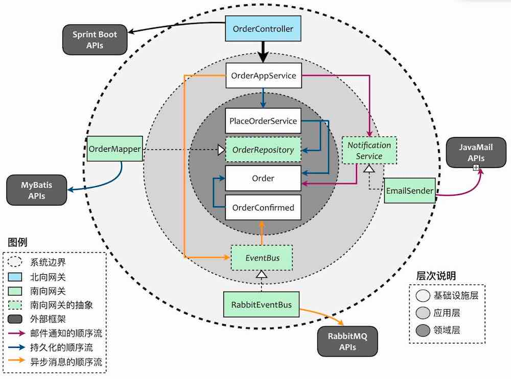

# 模块说明

# 上下文结构说明

## 说明：
这个架构图主要是明确各个模块和各层之间的职责，主要分为三层
- 基础设施层(infrastructure)： 
最外面的一圈,负责与第三方打交道;基础设施层根据其特点又可以叫gateway.
根据依赖方向,如果是被调用的方向，即由外至内的调用方向，就是北向，称之为北向网关。如果当前限界上下文是通过该网关调用外部资源或者别的限界上下文，即由内至外的调用方向，则是南向网关。

南向网关要特殊一些，它是打通应用层或领域层与外部资源（数据库、消息队列、第三方服务）的通道。根据整洁架构的设计原则，我们不能让内层依赖外层，以保证内层的纯粹性与稳定性。为了解除应用层或领域层与它的耦合，南向网关往往需要提供接口。这就说明，基础设施层的南向网关都是具体实现，内层对南向网关的调用则通过接口和依赖注入。至于它们的接口，就应该放在领域层或者应用层。例如，数据库的持久化属于南向网关，但它们的抽象Repository就属于领域层。

- 应用层
- 领域层

- application: 对应了领域驱动设计的应用层,主要内容为该限界上下文中所有的应用服务
- interfaces: 对gateways中除persistence之外的抽象，包括访问除数据库之外其他外部资源的抽象接口，
以及对第三方服务或其他限界上下文的抽象接口。从分层架构的角度讲,interfaces应该属于应用层,但在实践时，
往往会遭遇领域层需要访问这些抽象接口的情形，单独分离出interfaces,非常有必要。
- domain: 对应了领域驱动设计的领域层，但是我将repositories单独分了出来，目的是为了更好地体现它在基础设施层扮演的与外部资源打交道的网关语义。
- repositories:代表了领域驱动设计中战术设计阶段的资源库，皆为抽象类型。如果该限界上下文的资源库并不复杂，可以将repositories合并到domain中
- gateways(infrastructure):
对应了领域驱动设计的基础设施层，命名为gateways，则是为了更好地体现网关的语义，其下可以视外部资源的集成需求划分不同的包。其中，controllers相对特殊，它属于对客户端提供接口的北向网关，等同于上下文映射中“开放主机服务（OHS）”的概念。如果为了凸显它的重要性，可以将controllers提升到与application、domain、gateways同等层次。我之所以将其放在gateways之下，还是想体现它的网关本质。persistence对应了repositories抽象，至于其余网关，对应的则是application/interfaces下的抽象，包括消息队列以及与其他限界上下文交互的客户端，例如通过http通信的客户端。其中，client包下的实现类与interfaces下的对应接口组合起来，等同于上下文映射中“防腐层（ACL）”的概念。

# Context Map

Context Map中有两个常用的模式OHS(开放主机服务)与ACL(防腐层)。
显然，OHS对应前面提到的北向网关,ACL就对应着南向网关。
# 数据流对象
gateway: controller(Request, Response)
|          
Application Service: AppService(Dto, Dto)  -> AppService(Dto, Dto)  EventBus() -> infrastructure
|
Domain:  DomainService(Domain Object, Value Object)     
|
Domain: DomainObject     Repository(Domain Object, Value Object) 
|
infrastructure： Mapper(PO)    client()  